# 📚 COMPREHENSIVE PROJECT DOCUMENTATION
## Blockchain Donation Platform - Full Technical Analysis

---

## Table of Contents

1. [Project Overview](#1-project-overview)
2. [Architectural Design](#2-architectural-design)
3.  [Development Journey: From Scratch](#3-development-journey-from-scratch)
4. [Smart Contracts Deep Dive](#4-smart-contracts-deep-dive)
5. [Backend Architecture](#5-backend-architecture)
6. [Frontend Architecture](#6-frontend-architecture)
7. [Data Flow & Integration](#7-data-flow--integration)
8. [Security Considerations](#8-security-considerations)
9. [Configuration & Setup](#9-configuration--setup)
10. [Deployment Guide](#10-deployment-guide)

---

## 1. Project Overview

### 1.1 Purpose

This project is a **fully decentralized crowdfunding platform** built on Ethereum. It allows users to:
- Create fundraising campaigns with specific goals and deadlines
- Donate Ether (ETH) to campaigns transparently
- Automatically refund donors if campaigns fail
- Reward donors with tier-based badges (Bronze, Silver, Gold)
- Manage campaigns (pause, resume, withdraw funds)

### 1.2 Technology Stack


**Core Technologies**:
- **Blockchain**: Solidity ^0.8.20, OpenZeppelin Contracts
- **Smart Contract Framework**: Hardhat
- **Frontend**: React 18, Vite, TailwindCSS, React Router, React Toastify
- **Web3 Library**: ethers.js v6
- **Backend**: Node.js, Express.js
- **Database**: PostgreSQL
- **Testing Network**: Ethereum Sepolia Testnet / Hardhat Local Network

---

## 2. Architectural Design

### 2.1 Design Philosophy

The project follows a **Hybrid Architecture** combining:
1. **On-Chain Logic** (Smart Contracts): Immutable financial operations
2. **Off-Chain Caching** (Backend API): Fast metadata retrieval
3. **Decoupled Frontend**: User-friendly interface with Web3 integration

### 2.2 Why Hybrid Architecture?

| Aspect | Pure Blockchain | Hybrid Approach |
|--------|----------------|-----------------|
| **Data Integrity** | ✅ Perfect | ✅ Perfect (for finance) |
| **Query Speed** | ❌ Slow | ✅ Fast (cached) |
| **Cost** | ❌ High gas fees | ✅ Reduced reads |
| **User Experience** | ❌ Complex | ✅ Smooth |

**Design Decision**: Store financial transactions on-chain, cache metadata off-chain for performance.

### 2.3 Component Interaction Diagram


---

## 3. Development Journey: From Scratch

### 3.1 Phase 1: Project Initialization

#### Step 1: Hardhat Setup
```bash
npm init -y
npm install --save-dev hardhat
npx hardhat init
```

**What Happened**:
- Created a Hardhat project with pre-configured folders (`contracts/`, `scripts/`, `test/`)
- Installed Hardhat toolbox (includes ethers, chai, etc.)

#### Step 2: Install OpenZeppelin
```bash
npm install @openzeppelin/contracts
```

**Why OpenZeppelin?**  
OpenZeppelin provides battle-tested, audited smart contract libraries. We use:
- `ReentrancyGuard`: Prevents reentrancy attacks
- `ERC20`: Token standard for `PlatformToken`
- `ERC721`: NFT standard for `DonorBadge`

### 3.2 Phase 2: Smart Contract Development

#### Design Decisions

**1. Campaign Structure**  
Each campaign has:
- `id`: Unique identifier (auto-incremented)
- `creator`: Ethereum address of the campaign owner
- `goalAmount`: Target funding in Wei
- `deadline`: Unix timestamp
- `collectedAmount`: Current funding
- Status flags: `isPaused`, `isFunded`, `expired`

**2. Donation Reward System**  
Donations are categorized into tiers based on amount:
- **🥉 Bronze**: ≥ 0.1 ETH
- **🥈 Silver**: ≥ 0.5 ETH
- **🥇 Gold**: ≥ 1.0 ETH

**3. Security Patterns**  
- **Checks-Effects-Interactions (CEI)**: Update state before external calls
- **ReentrancyGuard**: Prevent double-spending during withdrawals
- **Access Control**: Only creators can pause/withdraw

### 3.3 Phase 3: Backend Development

#### Why a Backend?

**Problem**: Querying blockchain data is slow and expensive.  
**Solution**: Cache campaign metadata in PostgreSQL.

#### Database Schema

**campaigns** table:
```sql
CREATE TABLE campaigns (
    id SERIAL PRIMARY KEY,
    blockchain_id INTEGER UNIQUE,
    creator_address VARCHAR(42),
    title VARCHAR(255),
    description TEXT,
    goal_amount DECIMAL(18, 2),
    duration_days INTEGER,
    transaction_hash VARCHAR(66),
    is_funded BOOLEAN DEFAULT FALSE,
    created_at TIMESTAMP DEFAULT CURRENT_TIMESTAMP
);
```

**donations** table:
```sql
CREATE TABLE donations (
    id SERIAL PRIMARY KEY,
    campaign_id INTEGER REFERENCES campaigns(blockchain_id),
    donor_address VARCHAR(42),
    amount DECIMAL(18, 4),
    transaction_hash VARCHAR(66),
    reward_tier INTEGER,
    created_at TIMESTAMP DEFAULT CURRENT_TIMESTAMP
);
```

### 3.4 Phase 4: Frontend Development

#### React Application Structure

```
frontend/
├── src/
│   ├── components/
│   │   ├── CampaignForm.jsx       # Create campaigns
│   │   ├── CampaignList.jsx       # Browse campaigns
│   │   ├── CampaignDetail.jsx     # Campaign page + donations
│   │   ├── ConnectWallet.jsx      # MetaMask integration
│   │   ├── CreatorDashboard.jsx   # Manage your campaigns
│   │   └── DonationHistory.jsx    # View all donations
│   ├── services/
│   │   ├── web3Service.js         # Web3 logic layer
│   │   ├── contractABI.json       # Auto-generated
│   │   └── contractAddress.json   # Auto-generated
│   ├── App.jsx                    # Router setup
│   └── index.js                   # Entry point
```

#### Design Principles
- **Component Reusability**: Modular components for scalability
- **State Management**: React hooks (`useState`, `useEffect`)
- **Web3 Abstraction**: All blockchain calls isolated in `web3Service.js`

---

## 4. Smart Contracts Deep Dive

### 4.1 DonationPlatform.sol - Line-by-Line Analysis

#### Lines 1-26: Imports and Contract Definition

```solidity
// SPDX-License-Identifier: MIT
pragma solidity ^0.8.0;

import "@openzeppelin/contracts/utils/ReentrancyGuard.sol";
```

**Explanation**:
- `SPDX-License-Identifier`: Specifies the license (MIT = open source)
- `pragma solidity ^0.8.0`: Requires Solidity version 0.8.0 or higher
- `ReentrancyGuard`: Imported to protect against reentrancy attacks

#### Lines 15-33: Data Structures

```solidity
struct Campaign {
    uint id;
    address creator;
    string title;
    string description;
    uint goalAmount;        // in wei
    uint deadline;          // UNIX timestamp
    uint collectedAmount;   // in wei
    bool isPaused;
    bool isFunded;
    bool expired;
}

struct Donation {
    address donor;
    uint amount;
    uint timestamp;
    uint rewardLevel;       // 0=none, 1=bronze, 2=silver, 3=gold
}
```

**Design Rationale**:
- **`uint` vs `uint256`**: Same type (uint = uint256 by default)
- **Wei Units**: All amounts stored in Wei (1 ETH = 10^18 Wei) for precision
- **Booleans**: Gas-efficient state flags

#### Lines 37-40: State Variables

```solidity
mapping(uint => Campaign) public campaigns;
mapping(uint => Donation[]) public campaignDonations;
mapping(uint => mapping(address => uint)) public donorAmounts;
uint public campaignCounter;
```

**Data Structures Explained**:
1. `campaigns`: Maps campaign ID → Campaign struct
2. `campaignDonations`: Maps campaign ID → array of donations
3. `donorAmounts`: Nested mapping: campaign ID → donor address → total donated
4. `campaignCounter`: Auto-incrementing ID for new campaigns

#### Lines 112-140: createCampaign Function

```solidity
function createCampaign(
    string memory title,
    string memory description,
    uint goalAmount,
    uint durationDays
) external {
    require(goalAmount > 0, "Goal amount must be greater than 0");
    require(durationDays > 0, "Duration must be greater than 0");
    require(bytes(title).length > 0, "Title cannot be empty");
    require(bytes(description).length > 0, "Description cannot be empty");
    
    campaignCounter++;
    uint deadline = block.timestamp + (durationDays * 1 minutes);
    
    campaigns[campaignCounter] = Campaign({
        id: campaignCounter,
        creator: msg.sender,
        title: title,
        description: description,
        goalAmount: goalAmount,
        deadline: deadline,
        collectedAmount: 0,
        isPaused: false,
        isFunded: false,
        expired: false
    });
    
    emit CampaignCreated(campaignCounter, msg.sender, goalAmount, deadline);
}
```

**Key Points**:
- **Validation**: Uses `require` to validate inputs (gas-efficient revert)
- **`block.timestamp`**: Current time in Unix seconds (provided by Ethereum)
- **1 minutes**: Testing convenience (should be `1 days` in production)
- **`msg.sender`**: Address of the caller (campaign creator)
- **Emit Event**: Frontend listens to this event to get the campaign ID

#### Lines 146-179: donate Function

```solidity
function donate(uint campaignId) 
    external 
    payable 
    campaignExists(campaignId)
    nonReentrant 
{
    require(msg.value > 0, "Donation amount must be greater than 0");
    
    Campaign storage campaign = campaigns[campaignId];
    
    _checkExpiration(campaignId);
    
    require(!campaign.expired, "Campaign has expired");
    require(!campaign.isPaused, "Campaign is paused");
    require(!campaign.isFunded, "Campaign is already funded");
    
    uint rewardLevel = _calculateRewardLevel(msg.value);
    
    campaignDonations[campaignId].push(Donation({
        donor: msg.sender,
        amount: msg.value,
        timestamp: block.timestamp,
        rewardLevel: rewardLevel
    }));
    
    donorAmounts[campaignId][msg.sender] += msg.value;
    campaign.collectedAmount += msg.value;
    
    emit DonationReceived(campaignId, msg.sender, msg.value, rewardLevel);
}
```

**Critical Concepts**:
- **`payable`**: Function can receive Ether
- **`msg.value`**: Amount of Wei sent with the transaction
- **`storage` keyword**: Modifies the original struct (not a copy)
- **`nonReentrant`**: Prevents reentrancy attacks (from `ReentrancyGuard`)
- **Modifiers**: `campaignExists`, `nonReentrant` execute before function body

#### Lines 219-243: withdrawFunds Function (CEI Pattern)

```solidity
function withdrawFunds(uint campaignId) 
    external 
    campaignExists(campaignId)
    onlyCreator(campaignId)
    nonReentrant
{
    Campaign storage campaign = campaigns[campaignId];
    
    // CHECKS
    require(
        campaign.collectedAmount >= campaign.goalAmount,
        "Goal not reached yet"
    );
    require(!campaign.isFunded, "Funds already withdrawn");
    
    uint amount = campaign.collectedAmount;
    
    // EFFECTS
    campaign.isFunded = true;
    
    // INTERACTIONS
    (bool success, ) = payable(msg.sender).call{value: amount}("");
    require(success, "Transfer failed");
    
    emit FundsWithdrawn(campaignId, msg.sender, amount);
}
```

**Security Pattern: CEI (Checks-Effects-Interactions)**:
1. **Checks**: Validate conditions first
2. **Effects**: Update contract state
3. **Interactions**: Make external calls last

**Why?** If an external call triggers a callback, the state is already updated, preventing reentrancy.

**Modern Ether Transfer**:
- Old way: `msg.sender.transfer(amount)` (limited gas, can fail)
- New way: `.call{value: amount}("")` (forwards all gas, more flexible)

#### Lines 353-363: _calculateRewardLevel (Internal Helper)

```solidity
function _calculateRewardLevel(uint amount) internal pure returns (uint) {
    if (amount >= GOLD_THRESHOLD) {
        return 3; // Gold
    } else if (amount >= SILVER_THRESHOLD) {
        return 2; // Silver
    } else if (amount >= BRONZE_THRESHOLD) {
        return 1; // Bronze
    } else {
        return 0; // No reward
    }
}
```

**Visibility Modifiers**:
- **`internal`**: Can only be called within this contract or contracts that inherit from it
- **`pure`**: Does not read or modify state (gas-free if called internally)

### 4.2 DonorBadge.sol - NFT Contract

```solidity
contract DonorBadge is ERC721, Ownable {
    uint256 public nextTokenId;

    constructor() ERC721("DonorBadge", "DNB") Ownable(msg.sender) {}

    function mint(address to) external onlyOwner {
        _safeMint(to, nextTokenId);
        nextTokenId++;
    }
}
```

**Purpose**: Issue unique NFT badges to donors.

**Inheritance**:
- `ERC721`: Standard NFT implementation (OpenZeppelin)
- `Ownable`: Access control (only owner can mint)

**Usage Example**: After a Gold donation, the platform owner could mint a special NFT for the donor.

### 4.3 PlatformToken.sol - ERC20 Token

```solidity
contract PlatformToken is ERC20 {
    constructor(uint256 initialSupply) ERC20("PlatformToken", "PLT") {
        _mint(msg.sender, initialSupply);
    }
}
```

**Purpose**: Platform's native token (future use: governance, rewards).

---

## 5. Backend Architecture

### 5.1 server.js - Express API

#### Endpoint: GET /api/campaigns

```javascript
app.get('/api/campaigns', async (req, res) => {
    try {
        const query = `
            SELECT c.*, COALESCE(SUM(d.amount), 0) as collected_amount 
            FROM campaigns c 
            LEFT JOIN donations d ON c.blockchain_id = d.campaign_id 
            GROUP BY c.id 
            ORDER BY c.created_at DESC
        `;
        const result = await pool.query(query);
        res.json(result.rows);
    } catch (err) {
        console.error(err);
        res.status(500).json({ error: 'Server error' });
    }
});
```

**SQL Breakdown**:
- `LEFT JOIN`: Include campaigns even if they have no donations
- `COALESCE(SUM(d.amount), 0)`: If no donations, return 0 instead of NULL
- `GROUP BY c.id`: Aggregate donations per campaign

#### Endpoint: POST /api/campaigns

```javascript
app.post('/api/campaigns', async (req, res) => {
    const { blockchain_id, creator_address, title, description, goal_amount, duration_days, transaction_hash } = req.body;

    if (blockchain_id === undefined || !creator_address || !title || !description || !goal_amount || !duration_days || !transaction_hash) {
        return res.status(400).json({ error: 'All fields are required' });
    }

    try {
        const query = `
            INSERT INTO campaigns (blockchain_id, creator_address, title, description, goal_amount, duration_days, transaction_hash)
            VALUES ($1, $2, $3, $4, $5, $6, $7)
            RETURNING *;
        `;
        const values = [blockchain_id, creator_address, title, description, goal_amount, duration_days, transaction_hash];

        const result = await pool.query(query, values);
        res.status(201).json(result.rows[0]);
    } catch (err) {
        console.error(err);
        if (err.code === '23505') { // Unique violation
            return res.status(409).json({ error: 'Campaign already exists' });
        }
        res.status(500).json({ error: 'Server error' });
    }
});
```

**Parameterized Queries**: `$1, $2, ...` prevents SQL injection.

### 5.2 db.js - PostgreSQL Connection

```javascript
const { Pool } = require('pg');
require('dotenv').config();

const pool = new Pool({
    user: process.env.DB_USER || 'openpg',
    host: process.env.DB_HOST || 'localhost',
    database: process.env.DB_NAME || 'donations_db',
    password: process.env.DB_PASSWORD || 'openpgpwd',
    port: process.env.DB_PORT || 5432,
});

pool.query('SELECT NOW()', (err, res) => {
    if (err) {
        console.error('Error connecting to the database:', err);
    } else {
        console.log('Successfully connected to PostgreSQL database');
    }
});

module.exports = pool;
```

**Connection Pooling**: Reuses database connections for efficiency.

---

## 6. Frontend Architecture

### 6.1 web3Service.js - The Mastermind

This file orchestrates all Web3 interactions. Let's analyze key functions:

#### connectWallet()

```javascript
export const connectWallet = async () => {
    try {
        if (typeof window.ethereum === "undefined") {
            throw new Error("MetaMask is not installed. Please install MetaMask to use this application.");
        }

        const accounts = await window.ethereum.request({
            method: "eth_requestAccounts",
        });

        const chainId = await window.ethereum.request({ method: "eth_chainId" });
        const chainIdDecimal = parseInt(chainId, 16);

        if (chainIdDecimal !== REQUIRED_CHAIN_ID) {
            try {
                const hexChainId = "0x" + REQUIRED_CHAIN_ID.toString(16);
                await window.ethereum.request({
                    method: "wallet_switchEthereumChain",
                    params: [{ chainId: hexChainId }],
                });
            } catch (switchError) {
                if (switchError.code === 4902) {
                    throw new Error("Please add Sepolia network to MetaMask");
                }
                throw switchError;
            }
        }

        return accounts[0];
    } catch (error) {
        console.error("Error connecting wallet:", error);
        throw error;
    }
};
```

**Flow**:
1. Check if MetaMask is installed (`window.ethereum`)
2. Request account access
3. Verify network (Sepolia or localhost)
4. If wrong network, request switch
5. Return connected account

#### createCampaign()

```javascript
export const createCampaign = async (title, description, goalAmount, durationDays) => {
    try {
        const contract = await getContractInstance();
        const goalInWei = ethers.parseEther(goalAmount.toString());
        const duration = BigInt(Math.floor(Number(durationDays)));

        const tx = await contract.createCampaign(title, description, goalInWei, duration);
        const receipt = await tx.wait();

        // Find the CampaignCreated event
        let event = receipt.logs.find(log => log.fragment && log.fragment.name === 'CampaignCreated');

        if (!event) {
            // Manual parsing fallback
            const iface = new ethers.Interface(CONTRACT_ABI);
            for (const log of receipt.logs) {
                try {
                    const parsed = iface.parseLog({
                        topics: [...log.topics],
                        data: log.data
                    });
                    if (parsed && parsed.name === 'CampaignCreated') {
                        event = { args: parsed.args };
                        break;
                    }
                } catch (e) {}
            }
        }

        if (!event) {
            throw new Error("Campaign created but event not found. Check transaction logs in console.");
        }

        return {
            transactionHash: receipt.hash,
            campaignId: event.args[0],
        };
    } catch (error) {
        console.error("Error creating campaign:", error);
        throw error;
    }
};
```

**Steps**:
1. Get contract instance with signer (to send transactions)
2. Convert ETH to Wei using `ethers.parseEther()`
3. Send transaction to smart contract
4. Wait for transaction confirmation (`tx.wait()`)
5. Parse emitted event to extract campaign ID
6. Return transaction hash and campaign ID

**Why Parse Events?** The campaign ID is auto-generated on-chain. We need this ID to save to the database.

#### donate() with Backend Sync

```javascript
export const donate = async (campaignId, amountEth) => {
    try {
        const contract = await getContractInstance();
        const amountInWei = ethers.parseEther(amountEth.toString());

        const tx = await contract.donate(campaignId, { value: amountInWei });
        const receipt = await tx.wait();

        const event = receipt.logs.find(log => log.fragment && log.fragment.name === 'DonationReceived');
        const rewardLevel = event ? event.args[3] : 0;

        // Save to backend
        try {
            await fetch('http://localhost:5000/api/donations', {
                method: 'POST',
                headers: {
                    'Content-Type': 'application/json',
                },
                body: JSON.stringify({
                    campaign_id: Number(campaignId),
                    donor_address: await getCurrentAccount(),
                    amount: amountEth.toString(),
                    transaction_hash: receipt.hash,
                    reward_tier: Number(rewardLevel)
                }),
            });
        } catch (backendError) {
            console.error("Error saving donation to backend:", backendError);
        }

        return {
            transactionHash: receipt.hash,
            rewardLevel: rewardLevel,
        };
    } catch (error) {
        console.error("Error donating:", error);
        throw error;
    }
};
```

**Synchronization**:
1. Send donation transaction to blockchain
2. Extract reward level from event
3. Immediately save to backend database
4. If backend fails, transaction still succeeds (blockchain is source of truth)

#### getAllCampaigns() - Hybrid Fetch

```javascript
export const getAllCampaigns = async () => {
    try {
        // Try fetching from backend first
        try {
            const response = await fetch('http://localhost:5000/api/campaigns');
            if (response.ok) {
                const campaigns = await response.json();
                return campaigns.map(c => ({
                    id: c.blockchain_id,
                    creator: c.creator_address,
                    title: c.title,
                    description: c.description,
                    goalAmount: c.goal_amount,
                    deadline: Math.floor(new Date(c.created_at).getTime() / 1000) + (c.duration_days * 60),
                    collectedAmount: c.collected_amount ? c.collected_amount.toString() : "0",
                    isPaused: false,
                    isFunded: false,
                    expired: false,
                    fromDb: true
                }));
            }
        } catch (err) {
            console.warn("Backend unavailable, falling back to blockchain...", err);
        }

        // Fallback to blockchain
        const contract = getReadOnlyContract();
        const campaignCounter = await contract.campaignCounter();
        const campaigns = [];

        for (let i = 1; i <= campaignCounter; i++) {
            const campaign = await getCampaign(i);
            campaigns.push(campaign);
        }

        return campaigns;
    } catch (error) {
        console.error("Error getting all campaigns:", error);
        throw error;
    }
};
```

**Graceful Degradation**:
1. Try backend first (fast)
2. If backend is down, query blockchain directly (slow but reliable)
3. This ensures the app works even if the backend crashes

### 6.2 CampaignForm.jsx - Creating Campaigns

```javascript
const handleSubmit = async (e) => {
    e.preventDefault();

    if (!currentAccount) {
        toast.error("Please connect your wallet first");
        return;
    }

    setIsSubmitting(true);

    try {
        const result = await createCampaign(
            formData.title,
            formData.description,
            formData.goalAmount,
            formData.durationDays
        );

        // Save to backend
        await fetch('http://localhost:5000/api/campaigns', {
            method: 'POST',
            headers: { 'Content-Type': 'application/json' },
            body: JSON.stringify({
                blockchain_id: Number(result.campaignId),
                creator_address: currentAccount,
                title: formData.title,
                description: formData.description,
                goal_amount: formData.goalAmount,
                duration_days: formData.durationDays,
                transaction_hash: result.transactionHash
            }),
        });

        toast.success("Campaign created successfully!");
        navigate("/");
    } catch (error) {
        toast.error(error.message || "Failed to create campaign");
    } finally {
        setIsSubmitting(false);
    }
};
```

**User Flow**:
1. User fills form
2. Click "Create Campaign"
3. `createCampaign()` sends transaction to smart contract
4. Transaction confirmed → event parsed → campaign ID extracted
5. Frontend sends campaign metadata to backend
6. Success toast shown, redirect to campaigns list

### 6.3 CampaignDetail.jsx - Donation Page

```javascript
const handleDonate = async (e) => {
    e.preventDefault();

    if (!currentAccount) {
        toast.error("Please connect your wallet first");
        return;
    }

    setIsProcessing(true);

    try {
        const result = await donate(id, donationAmount);
        const rewardLevel = getRewardLevelName(result.rewardLevel);

        toast.success(
            <div>
                <p className="font-semibold">Donation successful! 🎉</p>
                <p className="text-sm">Reward: {rewardLevel}</p>
            </div>
        );

        setDonationAmount("");
        await loadCampaignData();
    } catch (error) {
        toast.error(error.message || "Failed to donate");
    } finally {
        setIsProcessing(false);
    }
};
```

**Smart UI Updates**:
- After donation succeeds, `loadCampaignData()` refreshes the page data
- Progress bar updates
- Donation list updates
- User's total donation updates

### 6.4 App.jsx - Routing

```javascript
<Routes>
    <Route path="/" element={<CampaignList />} />
    <Route path="/create" element={<CampaignForm currentAccount={currentAccount} />} />
    <Route path="/campaign/:id" element={<CampaignDetail currentAccount={currentAccount} />} />
    <Route path="/dashboard" element={<CreatorDashboard currentAccount={currentAccount} />} />
    <Route path="/history" element={<DonationHistory />} />
</Routes>
```

**React Router v6**: Client-side routing for single-page application.

---

## 7. Data Flow & Integration

### 7.1 Creating a Campaign: Complete Flow

```mermaid
sequenceDiagram
    autonumber
    participant User
    participant Frontend
    participant MetaMask
    participant Blockchain
    participant Backend
    participant DB

    User->>Frontend: Fill campaign form
    User->>Frontend: Click "Create Campaign"
    Frontend->>Frontend: Validate inputs
    Frontend->>MetaMask: createCampaign(title, desc, goal, duration)
    MetaMask->>User: Request signature
    User->>MetaMask: Approve transaction
    MetaMask->>Blockchain: Send signed transaction
    Blockchain->>Blockchain: Execute createCampaign()
    Blockchain->>Blockchain: campaignCounter++
    Blockchain->>Blockchain: Store Campaign struct
    Blockchain->>Blockchain: Emit CampaignCreated event
    Blockchain-->>MetaMask: Transaction receipt + event
    MetaMask-->>Frontend: Receipt { hash, logs }
    Frontend->>Frontend: Parse event → extract campaignId
    Frontend->>Backend: POST /api/campaigns { blockchain_id, ... }
    Backend->>DB: INSERT INTO campaigns
    DB-->>Backend: Success
    Backend-->>Frontend: 201 Created
    Frontend-->>User: Success toast + redirect
```



### 7.2 Donating: Complete Flow


---

## 8. Security Considerations

### 8.1 Smart Contract Security

#### 1. Reentrancy Protection

**Risk**: Malicious contract calls back during Ether transfer, draining funds.

**Solution**:
```solidity
import "@openzeppelin/contracts/utils/ReentrancyGuard.sol";

contract DonationPlatform is ReentrancyGuard {
    function withdrawFunds(uint campaignId) 
        external 
        nonReentrant  // ✅ Prevents reentrancy
    { ... }
}
```

#### 2. Checks-Effects-Interactions Pattern

**Bad Example**:
```solidity
// ❌ VULNERABLE
function withdraw() external {
    uint amount = balances[msg.sender];
    (bool success, ) = msg.sender.call{value: amount}("");  // External call BEFORE state update
    balances[msg.sender] = 0;  // Too late! Attacker can reenter
}
```

**Good Example (Our Implementation)**:
```solidity
// ✅ SECURE
function withdrawFunds(uint campaignId) external nonReentrant {
    Campaign storage campaign = campaigns[campaignId];
    
    // ✅ CHECKS
    require(campaign.collectedAmount >= campaign.goalAmount, "Goal not reached");
    require(!campaign.isFunded, "Already withdrawn");
    
    uint amount = campaign.collectedAmount;
    
    // ✅ EFFECTS
    campaign.isFunded = true;  // Update state FIRST
    
    // ✅ INTERACTIONS
    (bool success, ) = payable(msg.sender).call{value: amount}("");  // External call LAST
    require(success, "Transfer failed");
}
```

#### 3. Access Control

**Only creators can manage their campaigns**:
```solidity
modifier onlyCreator(uint campaignId) {
    require(
        campaigns[campaignId].creator == msg.sender,
        "Only campaign creator can perform this action"
    );
    _;
}

function pauseCampaign(uint campaignId) 
    external 
    onlyCreator(campaignId)  // ✅ Enforces ownership
{ ... }
```

#### 4. Integer Overflow (Mitigated in Solidity 0.8+)

**Before Solidity 0.8**:
```solidity
uint256 a = 2^256 - 1;  // Max uint256
a = a + 1;  // Wraps to 0 (overflow) ❌
```

**Solidity 0.8+**:
```solidity
uint256 a = 2^256 - 1;
a = a + 1;  // Reverts automatically ✅
```

Our project uses Solidity 0.8.20, so overflow protection is built-in.

### 8.2 Frontend Security

#### 1. Input Validation

```javascript
// ✅ Validate before sending transaction
if (!formData.title || !formData.description || !formData.goalAmount || !formData.durationDays) {
    toast.error("All fields are required");
    return;
}

if (parseFloat(formData.goalAmount) <= 0) {
    toast.error("Goal amount must be greater than 0");
    return;
}
```

#### 2. Network Verification

```javascript
const ensureCorrectNetwork = async () => {
    const chainId = await window.ethereum.request({ method: "eth_chainId" });
    const chainIdDecimal = parseInt(chainId, 16);

    if (chainIdDecimal !== REQUIRED_CHAIN_ID) {
        // Force network switch
        await window.ethereum.request({
            method: "wallet_switchEthereumChain",
            params: [{ chainId: hexChainId }],
        });
    }
};
```

**Why Important?** Prevents users from sending transactions to wrong networks.

### 8.3 Backend Security

#### 1. SQL Injection Prevention

**Bad (Vulnerable)**:
```javascript
// ❌ NEVER DO THIS
const query = `SELECT * FROM campaigns WHERE id = ${req.params.id}`;
```

**Good (Our Implementation)**:
```javascript
// ✅ Parameterized queries
const query = 'SELECT * FROM campaigns WHERE blockchain_id = $1';
const result = await pool.query(query, [req.params.id]);
```

#### 2. Environment Variables

```javascript
// .env file (never commit to Git!)
DB_PASSWORD=supersecretpassword
PRIVATE_KEY=0x123abc...
```

```javascript
// Usage
const password = process.env.DB_PASSWORD;
```

---

## 9. Configuration & Setup

### 9.1 hardhat.config.js

```javascript
module.exports = {
  solidity: {
    version: "0.8.20",
    settings: {
      optimizer: {
        enabled: true,
        runs: 200,
      },
    },
  },
  networks: {
    hardhat: {
      chainId: 1337,
    },
    sepolia: {
      url: process.env.SEPOLIA_RPC_URL,
      accounts: process.env.PRIVATE_KEY ? [process.env.PRIVATE_KEY] : [],
      chainId: 11155111,
    },
    localhost: {
      url: "http://127.0.0.1:8545",
      chainId: 1337,
    },
  },
};
```

**Key Configurations**:
- **Optimizer**: Reduces contract size and gas costs (200 runs = balanced)
- **Networks**: 
  - `hardhat`: In-memory network for testing
  - `localhost`: Local Hardhat node
  - `sepolia`: Ethereum testnet

### 9.2 Environment Variables

**Root .env** (Hardhat):
```bash
SEPOLIA_RPC_URL=https://sepolia.infura.io/v3/YOUR_PROJECT_ID
PRIVATE_KEY=0xYOUR_PRIVATE_KEY
ETHERSCAN_API_KEY=YOUR_ETHERSCAN_KEY
```

**Backend .env**:
```bash
DB_USER=openpg
DB_HOST=localhost
DB_NAME=donations_db
DB_PASSWORD=openpgpwd
DB_PORT=5432
PORT=5000
```

---

## 10. Deployment Guide

### 10.1 Local Development Setup

#### Step 1: Install Dependencies

```bash
# Root (Hardhat)
npm install

# Backend
cd backend
npm install

# Frontend
cd frontend
npm install
```

#### Step 2: Start PostgreSQL

```bash
# Install PostgreSQL (Windows)
# Download from https://www.postgresql.org/download/

# Create database
psql -U postgres
CREATE DATABASE donations_db;
CREATE USER openpg WITH PASSWORD 'openpgpwd';
GRANT ALL PRIVILEGES ON DATABASE donations_db TO openpg;
```

#### Step 3: Initialize Database

```bash
cd backend
node init-db.js
```

#### Step 4: Start Local Blockchain

```bash
# Terminal 1 (in root directory)
npx hardhat node
```

This creates a local Ethereum network at `http://127.0.0.1:8545`.

#### Step 5: Deploy Smart Contract

```bash
# Terminal 2 (in root directory)
npx hardhat run scripts/deploy.js --network localhost
```

**What Happens**:
1. Contract deployed to local network
2. Address saved to `frontend/src/services/contractAddress.json`
3. ABI saved to `frontend/src/services/contractABI.json`

#### Step 6: Start Backend Server

```bash
# Terminal 3
cd backend
npm start
```

Server runs at `http://localhost:5000`.

#### Step 7: Start Frontend

```bash
# Terminal 4
cd frontend
npm run dev
```

Frontend runs at `http://localhost:5173`.

#### Step 8: Configure MetaMask

1. Install MetaMask browser extension
2. Add Localhost network:
   - Network Name: Localhost 8545
   - RPC URL: http://127.0.0.1:8545
   - Chain ID: 1337
   - Currency: ETH
3. Import test account from Hardhat (copy private key from Terminal 1)

### 10.2 Testnet Deployment (Sepolia)

#### Step 1: Get Sepolia ETH

1. Visit https://sepoliafaucet.com/
2. Enter your MetaMask address
3. Receive test ETH

#### Step 2: Configure Environment

```bash
# .env
SEPOLIA_RPC_URL=https://sepolia.infura.io/v3/YOUR_PROJECT_ID
PRIVATE_KEY=0xYOUR_PRIVATE_KEY_FROM_METAMASK
```

#### Step 3: Deploy to Sepolia

```bash
npx hardhat run scripts/deploy.js --network sepolia
```

#### Step 4: Verify on Etherscan

```bash
npx hardhat verify --network sepolia CONTRACT_ADDRESS
```

---

## Conclusion

This project demonstrates a production-ready blockchain application with:
- ✅ Secure smart contract design
- ✅ Scalable hybrid architecture
- ✅ User-friendly interface
- ✅ Comprehensive error handling
- ✅ Real-world deployment readiness

**Next Steps**:
- Add unit tests for smart contracts
- Implement CI/CD pipeline
- Add governance features using `PlatformToken`
- Mint `DonorBadge` NFTs for top donors

---

**Last Updated**: 2025-12-18  
**Version**: 2.0.0
