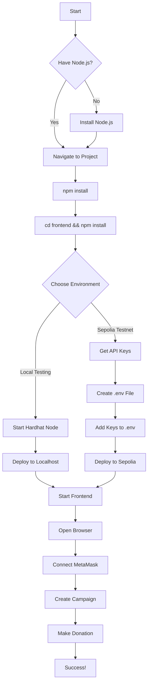
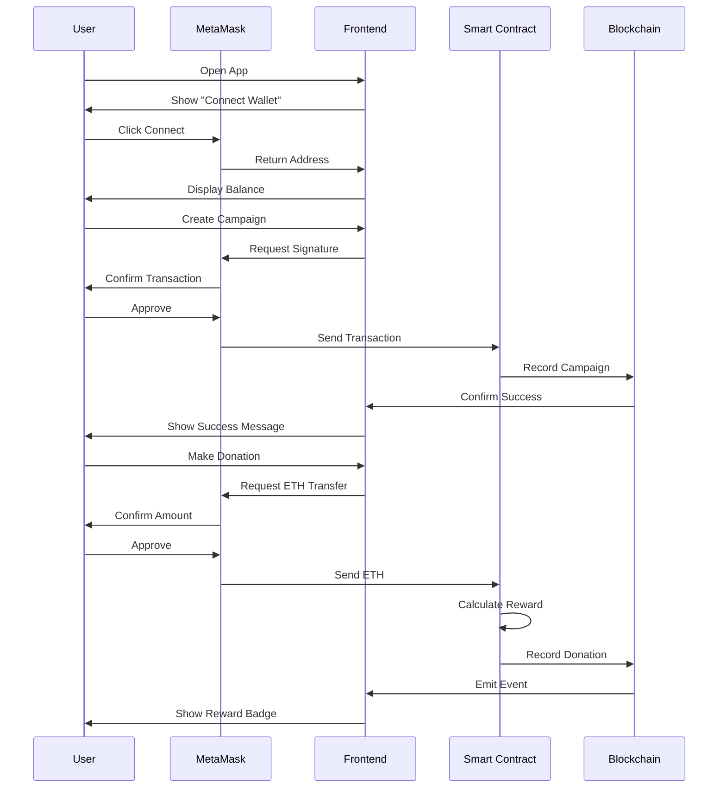

# 🗺️ Visual Guide - Project Flow

## 📊 Complete Setup Flow Diagram



## 🔄 User Interaction Flow



## 📁 File Structure & Where Things Go

```
projet/
│
├── 📄 .env                          👈 CREATE THIS! Add your keys here
│   ├── SEPOLIA_RPC_URL=...         
│   ├── PRIVATE_KEY=...             
│   └── ETHERSCAN_API_KEY=...       
│
├── 📄 .env.example                  👈 Template for .env
│
├── 📄 hardhat.config.js             ← Reads from .env
│
├── 📂 contracts/
│   └── 📄 DonationPlatform.sol      ← Smart contract code
│
├── 📂 scripts/
│   └── 📄 deploy.js                 ← Deployment script
│                                      Saves to ↓
│
├── 📂 test/
│   └── 📄 DonationPlatform.test.js  ← Run: npx hardhat test
│
└── 📂 frontend/
    ├── 📂 src/
    │   ├── 📂 services/
    │   │   ├── 📄 contractABI.json      ← Auto-created by deploy.js
    │   │   ├── 📄 contractAddress.json  ← Auto-created by deploy.js
    │   │   └── 📄 web3Service.js        ← Uses above files
    │   │
    │   ├── 📂 components/               ← React UI components
    │   └── 📄 App.jsx                   ← Main app
    │
    └── 📄 package.json
```

## 🎯 Key Locations Reference

### Where to Add API Keys

```
File: .env (in project root)
Location: c:\Users\adhem\OneDrive\Bureau\Course\blockchain\projet\.env

Add these lines:
SEPOLIA_RPC_URL=https://sepolia.infura.io/v3/YOUR_INFURA_KEY
PRIVATE_KEY=your_metamask_private_key
ETHERSCAN_API_KEY=your_etherscan_key
```

### Where Contract Address Gets Saved

```
After deployment, automatically saved to:
frontend/src/services/contractAddress.json

Example content:
{
  "DonationPlatform": "0x1234567890abcdef...",
  "network": "sepolia",
  "chainId": 11155111
}
```

### Where ABI Gets Saved

```
After deployment, automatically saved to:
frontend/src/services/contractABI.json

This file contains the contract's interface
Frontend uses it to interact with the contract
```

## 🔐 Security: What NOT to Share

```
❌ NEVER COMMIT TO GIT:
├── .env                    ← Contains private key!
├── .env.local
└── Any file with "private key" or "secret"

✅ SAFE TO COMMIT:
├── .env.example            ← Template without real keys
├── All .sol files
├── All .js files
└── package.json
```

## 🚀 Deployment Process Visual

```
┌─────────────────────────────────────────────┐
│  1. Compile Contract                        │
│     npx hardhat compile                     │
│     ↓                                        │
│     Creates: artifacts/                     │
└─────────────────────────────────────────────┘
                    ↓
┌─────────────────────────────────────────────┐
│  2. Run Tests                               │
│     npx hardhat test                        │
│     ↓                                        │
│     All tests pass ✅                       │
└─────────────────────────────────────────────┘
                    ↓
┌─────────────────────────────────────────────┐
│  3. Deploy to Network                       │
│     npx hardhat run scripts/deploy.js       │
│     --network sepolia                       │
│     ↓                                        │
│     Contract deployed to blockchain         │
│     Address: 0x1234...                      │
└─────────────────────────────────────────────┘
                    ↓
┌─────────────────────────────────────────────┐
│  4. Auto-Save Address & ABI                 │
│     deploy.js saves:                        │
│     - contractAddress.json                  │
│     - contractABI.json                      │
│     ↓                                        │
│     Frontend can now connect to contract    │
└─────────────────────────────────────────────┘
                    ↓
┌─────────────────────────────────────────────┐
│  5. Start Frontend                          │
│     cd frontend                             │
│     npm start                               │
│     ↓                                        │
│     App running at localhost:3000           │
└─────────────────────────────────────────────┘
```

## 🎮 Campaign Lifecycle Visual

```
┌──────────────┐
│  CREATE      │  Creator creates campaign
│  Campaign    │  Set: title, goal, duration
└──────┬───────┘
       │
       ↓
┌──────────────┐
│  🟢 OPEN     │  Anyone can donate
│  Status      │  Donations accumulate
└──────┬───────┘
       │
       ├─────────────────┐
       │                 │
       ↓                 ↓
┌──────────────┐  ┌──────────────┐
│  ⏸️ PAUSED   │  │ ⏰ EXPIRED   │
│  Status      │  │  Status      │
│ (by creator) │  │ (time's up)  │
└──────┬───────┘  └──────┬───────┘
       │                 │
       ↓                 ↓
┌──────────────┐  ┌──────────────┐
│  ▶️ RESUMED  │  │ Goal reached?│
│  Back to     │  └──────┬───────┘
│  OPEN        │         │
└──────────────┘    ┌────┴────┐
                    │         │
                    ↓         ↓
            ┌──────────────┐ ┌──────────────┐
            │ ✅ FUNDED   │ │ 💸 REFUNDS  │
            │ Withdraw    │ │ Return funds │
            │ available   │ │ to donors    │
            └─────────────┘ └──────────────┘
```

## 🏆 Reward System Visual

```
Donation Amount (ETH)    →    Reward
─────────────────────────────────────
   0.01 - 0.09          →    ⚪ None
   0.10 - 0.49          →    🥉 Bronze
   0.50 - 0.99          →    🥈 Silver
   1.00+                →    🥇 Gold

Example:
User donates 0.15 ETH  →  Gets Bronze Badge
User donates 0.75 ETH  →  Gets Silver Badge
User donates 2.50 ETH  →  Gets Gold Badge
```

## 📱 MetaMask Configuration Visual

```
For Local Testing:
┌─────────────────────────┐
│ Network: Localhost 8545 │
│ Chain ID: 1337          │
│ Currency: ETH           │
│                         │
│ Import Account:         │
│ Private Key from        │
│ hardhat node output     │
└─────────────────────────┘

For Sepolia Testing:
┌─────────────────────────┐
│ Network: Sepolia        │
│ Chain ID: 11155111      │
│ Currency: SepoliaETH    │
│                         │
│ Get Test ETH from:      │
│ sepoliafaucet.com       │
└─────────────────────────┘
```

## 📊 Component Communication Flow

```
Components Layout:
┌─────────────────────────────────────┐
│         App.jsx (Router)            │
├─────────────────────────────────────┤
│  Header: ConnectWallet              │
├─────────────────────────────────────┤
│  Routes:                            │
│  ├─ CampaignList                    │
│  ├─ CampaignForm                    │
│  ├─ CampaignDetail                  │
│  │   ├─ Donation Form               │
│  │   ├─ Donation List               │
│  │   └─ Creator Actions             │
│  ├─ CreatorDashboard                │
│  └─ DonationHistory                 │
└─────────────────────────────────────┘
         ↕️
    web3Service.js
         ↕️
  Smart Contract (Blockchain)
```

---

## 🎓 Learning Path

```
1. Start Here  →  2. Learn Basics  →  3. Deploy Local  →  4. Test Features  →  5. Deploy Sepolia
     ↓                  ↓                    ↓                   ↓                    ↓
 Read guides    Run test suite    Use localhost     Create/donate      Production-like
 QUICKSTART.md  npx hardhat test  Faster testing    Test all flows     Real testnet
```

---

This visual guide should give you a clear overview! Check:
- **QUICKSTART.md** for fast commands
- **SETUP_GUIDE.md** for detailed step-by-step
- **README.md** for full documentation
